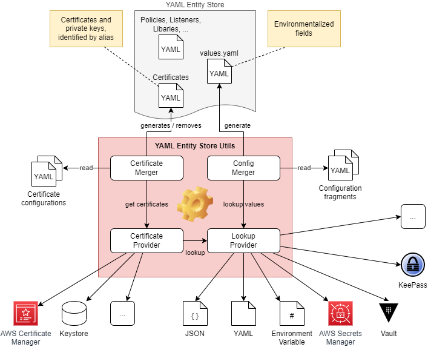
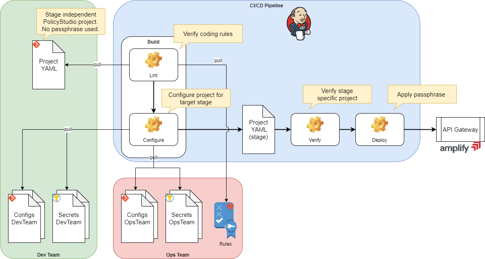

= YAML Entity Store Utilities
:Author: Martin Look
:Email: mlook@axway.com
:toc:
ifndef::env-github[:icons: font]
ifdef::env-github[]
:outfilesuffix: .adoc
:!toc-title:
:caution-caption: :fire:
:important-caption: :exclamation:
:note-caption: :paperclip:
:tip-caption: :bulb:
:warning-caption: :warning:
endif::[]
ifndef::revnumber[:revnumber: 0.7.1]

image:https://github.com/Axway-API-Management-Plus/yamles-utils/actions/workflows/maven-publish.yml/badge.svg[Workflow Status]
image:https://img.shields.io/github/license/Axway-API-Management-Plus/yamles-utils?style=plastic[]
image:https://img.shields.io/github/v/release/Axway-API-Management-Plus/yamles-utils?style=plastic[]

IMPORTANT: The project is community supported and not supported by Axway Support. If you encounter any issues, please raise a GitHub issue on this project.

[sidebar]
.tl;dr
--
Utilities to verify coding rules of YAML Entity Store based projects and to configure projects for target environments using various configuration sources.
--

.Quick Start
[%collapsible]
====

*Using Docker Image*

[source,shell,subs="verbatim,attributes"]
----
docker run -ti --rm \
  -e "NAME=World" \
  ghcr.io/axway-api-management-plus/yamles-utils:{revnumber} \
  -q eval "Hello {{ _env('NAME') }}!" \
&& echo
----

*Build from repository*

.Clone repository and create ZIP distribution
[source,shell]
----
git clone https://github.com/Axway-API-Management-Plus/yamles-utils.git
cd yamles-utils
./mvnw clean package
----

.Unpack distribution
[source,shell,subs="verbatim,attributes"]
----
unzip target/yamles-utils-{revnumber}.zip -d target
----

.Execute tool (Unix)
[source,shell,subs="verbatim,attributes"]
----
target/yamles-utils-{revnumber}/bin/yamlesutils.sh --help
----

.Execute tool (Windows)
[source,shell,subs="verbatim,attributes"]
----
target\yamles-utils-{revnumber}\bin\yamlesutils.cmd --help
----
====

== Introduction

Since the 7.7 February'22 release of the Axway API Gateway, Policy Studio supports to edit policy projects in the YAML Entity Store (YAML-ES) format.
This format enables fine grained storage of project entities, in easy to read and easy to compare YAML files.

The YAML Entity Store has many advantages compared to the legacy XML based Entity Store:

* Project entities are stored in fine grained, easy to read YAML files.
* Easy comparison of different versions of a file.
* Easy file merge, on concurrent editing.
* Storing in a SCM (e.g, Git) changes can be easily checked.
* Environmentalized values configured in a single YAML file.

Beside these advantages, there are still some challenges.
From the experience of the link:https://github.com/Axway-API-Management-Plus/apigw-maven-plugin[Maven Plugin for API Gateway] project, storing configuration in one single file, may not always met the requirements.
On staging, self-signed certificates may have to be replaced by certificates provided by the in-house CA.
Credentials are stored in a separate database and have to be configured on deployment time.
For K8s deployments, the API Gateway may has to be configured via an init container on startup of the pod. And other scenarios you may think of.

This project provides the flexibility, to collect configuration parameters, credentials, and certificates from various sources, and use them to configure the YAML-ES of API Gateway for runtime.

== Use Cases

NOTE: The following use case is for explanation purpose only.
Projects don't have to follow the described responsibilities.

=== CI/CD Pipeline

==== Challenge

In this example, a development team implements policies for the Axway API Manager/Gateway.
The development team is responsible for the configuration of policies and for the connections to the backend systems.

The operation team is responsible to setup the infrastructure and to configure the main API Manager settings.

Policy Studio project contains the full configuration of an API Gateway.
This includes configurations the developers are responsible for and configuration for which the operation team is responsible.
Even if the values are environmentalized, both teams are responsible to configure the same file (`values.yaml`) for the different stages.
In addition to non critical configurations, the file also contains confidential values (e.g., passwords).

For staging the project, certificates stored in the YAML-ES have to be replaced by the stage specific counterpart.

==== Solution

Configurations with shared responsibility or staged dependent values are environmentalized.
A linter checks the project against coding rules (defined by the Ops team) to ensure that all required fields are environmentalized and all required entities exists.

With stage specific configurations (including certificates), a stage specific project is created.

Configuration parameter are sourced from multiple locations.
Configurations are retrieved from plain text files stored in the Git repository or from encrypted data sources.
Each team has its own set of configuration parameter (depending on their responsibility). Hierarchies of configurations ensures that values configured the Ops team supersede values defined by the Dev team.

The generated, stage specific project is verified for unconfigured fields or broken references.

After successful verification the project will be deployed to the target environment.
During the deployment a passphrase is added to protect the configurations.

.CI/CD Pipeline

The picture above visualize the CI/CD pipeline.
The _YAML-ES Utilities_ tool provided by this project is used for linting and for the configuration of the stage specific project.

==== Example

The `examples` folder provides a demo of the previously described pipeline (except the deployment task) - see link:examples/README.adoc[examples] for details.

== Features

The _YAML-ES Utilities_ provide the following features:

* Linting.
** Lint API Gateway project against customized rules.
** Rules can be sourced from multiple locations.
* Merge configuration from multiple files into a result `values.yaml` file.
* Lookup values from multiple data sources.
*** YAML files
*** JSON files
*** Environment variables (plain text or JSON document)
*** System properties
*** Keepass DB
*** Hashicorp Vault
*** AWS Secrets Manager
* Merge certificates from multiple sources into the API Gateway project.
** Keystore: Add/overwrite certificates from PKCS#12 or JKS key stores
** Simple: Add/overwrite certificates by simple Base64 encoded values (can be combined with value lookup, see above).
** Remover: Remove certificates from the project
** AWS Certificate Manager

== More to Read

* https://axway-api-management-plus.github.io/yamles-utils/[User Guide]
* https://docs.axway.com/bundle/axway-open-docs/page/docs/api_mgmt_overview/index.html[Amplify API Management]
* https://docs.axway.com/bundle/axway-open-docs/page/docs/apim_yamles/index.html[YAML Configuration]
* https://docs.axway.com/bundle/axway-open-docs/page/docs/apim_yamles/yamles_structure/index.html[YAML Entity Store Structure]

== Contributing
Please read https://github.com/Axway-API-Management-Plus/Common/blob/master/Contributing.md[Contributing] for details on our code of conduct, and the process for submitting pull requests to us.

== Team
image:https://raw.githubusercontent.com/Axway-API-Management-Plus/Common/master/img/AxwayLogoSmall.png[Axway Logo] Axway Team

== License
link:./LICENSE[Apache License 2.0]
